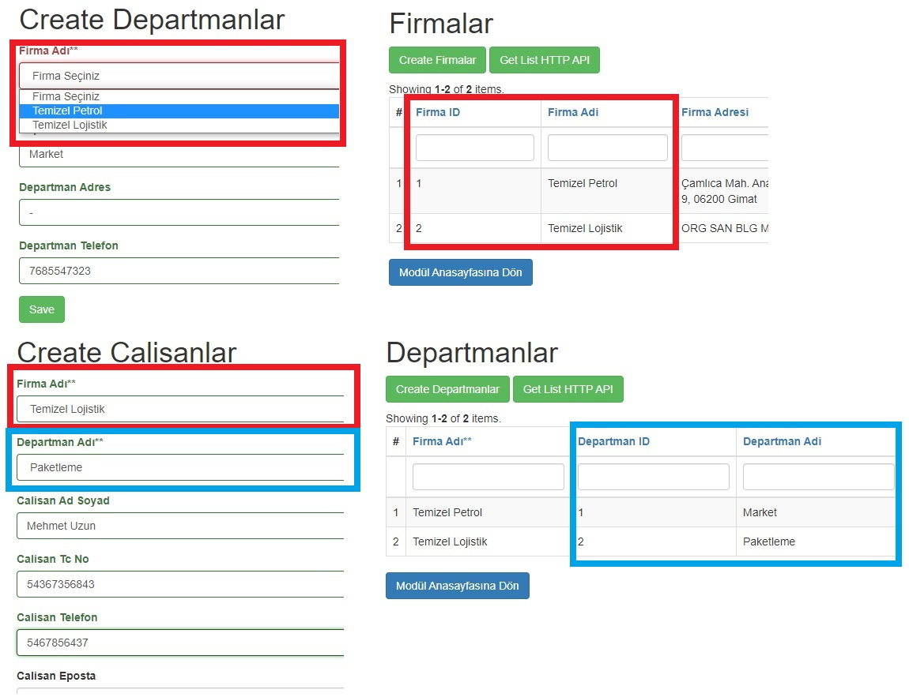

# yii2-fdcys
Firma-Departman-Çalışan Yönetim Sistemi Modülü

# Hakkında

Bu modül aracılığıyla firmalar yaratabilir, bu firmalara bağlı departmanlar oluşturabilir ve departmanlar altında da çalışan insanların bilgilerini tutabilirsiniz. Modül İnternet Programcılığı dersinin uygulamasıdır. İlerleyen kısmınlarda daha detaylı bilgi verilecektir.

# Kurulum

Modül kurulumu vagrant ve yii2-advanced template'i üzerinden anlatılacaktır. Modül kurulumu için öncelikle vagrant üzerinde çalışan yii2-advanced kurulumunu gerçekleştiriniz.

ssh veya vagrant ssh ile vagrant üzerinde yii projenizin ana dizinine gidiniz.(Örneğin /var/www/advanced)

```
composer require --prefer-dist burakcantemizel/yii2-fdcys "dev-master"
 ```

komutu ile packagist üzerinden modül kurulumunu gerçekleştiriniz.
    
Daha sonrasında yii projenizin ana dizininde backend\config\main.php dosyasını düzenlemek için açınız. Aşağıda gösterildiği şekilde düzenlemeyi yapınız.

```
'modules' => [
    ...
    'fdcys' => [
        'class' => 'burakcantemizel\\fdcys\Module',
    ],
],
 ```

<strong>Önemli Not: Burada önemli bir nokta "\f" özel karakter olduğu için slash karakteri kaçış karakteri olarak girilmiştir buna dikkat ediniz.</strong>

Composer kurulumuyla ilgili problem yaşarsanız yii projenizin ana dizininde vendor\burakcantemizel klasörünü oluşturup git reposunu clonelayabilirsiniz.

Modülün çalışabilmesi için son olarak migration işleminin gerçekleştirilmesi gereklidir.

ssh bağlantısı ile vagrant üzerinde proje ana dizinindeyken alttaki komut çalıştırılmalıdır.

```
php yii migrate/up --migrationPath=@vendor/burakcantemizel/yii2-fdcys/src/migrations
 ```

 Artık migration işlemimiz gerçekleştirilmiştir. Modülümüz çalışır hale gelmiştir.

 Modülü test etmek için tarayıcınızda siteAdresi/backend/web/index.php?r=fdcys adresine gidiniz. Modül anasayfasını karşınızda göreceksiniz.


# Modül Tanıtımı ve Proje Raporu

Bu kısımda modülün içeriği, derslerin uygulamaları vs. gösterilecektir ve bazı kısımlar özet olarak anlatılacaktır.

## Migrations

Modül içerisindeki migration dosyasında modül içerisinde kullanılacak 3 adet tablo oluşturulmuştur. Tablolar arasında foreign keyler ile ilişkiler kurulmuştur ve anahtar değerler için indekslemeler yapılmıştır. Firmalar, Departmanlar ve Çalışanlar için 3 adet tablo bulunmaktadır. Tablolar arasındaki ilişkiler aşağıda gösterildiği şekildedir. 3 adet foreign key kullanılmıştır.


Daha sonra model oluşturulurken bu ilişkisel şemalar kullanılacaktır.

## Gii, Models ve CRUD

Her tablo için migration ile tanımlanan ilişkisel özellikler baz alınarak gii üzerinden modeller oluşturulmuştur. İlişkilere göre her model için farklı tekil ve çoğul activeQuery metotları oluşmuştur. Örneğin Departmanlar tablosu için;

```
     /**
     * Gets query for [[Calisanlars]].
     *
     * @return \yii\db\ActiveQuery
     */
    public function getCalisanlars()
    {
        return $this->hasMany(Calisanlar::className(), ['departmanlar_departman_id' => 'departman_id']);
    }

    /**
     * Gets query for [[FirmalarFirma]].
     *
     * @return \yii\db\ActiveQuery
     */
    public function getFirmalarFirma()
    {
        return $this->hasOne(Firmalar::className(), ['firma_id' => 'firmalar_firma_id']);
    }
 ```

  Daha sonra temel işlevsellik İçin Gii ile bu modeller üzerinden CRUD oluşturulmuştur. CRUD oluşturulurken controllerlar ve viewlarda generate edilmiştir. Daha sonrasında gerekli düzenlemelerle tablolar birbirine bağlanacaktır.

## Formlar, Widget

Formlar üzerinde çeşitli düzenlemeler yapılmıştır. Örneğin çalışanlar _form.php için ilişkisel id columnları aşağıdaki şekilde düzenlenmiştir. ArrayHelper, DropDownList gibi çeşitli yapılar kullanılarak ilişkili tablodan id ye karşılık gelen ismin seçilebilmesi sağlanmıştır.

```
<?= $form->field($model, 'departmanlar_departman_id')->dropDownList(
        ArrayHelper::map(Departmanlar::find()->all(),'departman_id', 'departman_adi'),
        ['prompt' => 'Departman Seçiniz']
    ) ?>
```

aynı şekilde çalışanlar index.php içerisined GridView widgetı düzenlenerek ilişkisel id kısımları karşılık gelen isimlerle değiştirilmiştir.
```
 <?= GridView::widget([
        ...
            [
                'attribute' => 'departmanlar_departman_id',
                'value' => 'departmanlarDepartman.departman_adi',
            ],

            [
                'attribute' => 'firmalar_firma_id',
                'value' => 'firmalarFirma.firma_adi',
            ],
            
            ...
```

Bu işlemlerin sonunda artık Çalışanlar tablosunda create işlemi yaptığımızda Firma seçerken Firmalar tablosundaki mevcut firmalar listeleniyor, aynı şekilde departman seçimi yaptığımızda da departmanlar tablosunda bulunan departmanlar listeleniyor. Daha sonrasında görüntülenirken de artık ilişkiler idler ile değil de id'lere karşılık gelen departman ve firma isimleriyle kullanıcıya sunuluyor.



Tablolar birbiri ile ilişkili olduğu için ilişkili bir kayıtı sildiğinizde bağlı olan diğer kayıtlarda silinecektir. Örneğin bir departmanı silerseniz o departmanda çalışan tüm kişilerin kayıtları da silinecektir.

## Search Model ve Query

Columnlarda id ler ile isimleri ilişkilendirikten sonra search model üzerinde bir düzenleme daha yapmak gerekiyordu. Çünkü seach model hala idler üzerinden arama işlemini gerçekleştiriyodu bizim bunu isim olarak değiştirmemiz gerekliydi. Yine çalışanların search modeli üzerinden örneklersek

```
    ...
        $query->joinWith('firmalarFirma');
        $query->joinWith('departmanlarDepartman');
        ...
        $query->andFilterWhere(['like', 'calisan_ad_soyad', $this->calisan_ad_soyad])
            ...
            ->andFilterWhere(['like', 'firmalar.firma_adi', $this->firmalar_firma_id])
            ->andFilterWhere(['like', 'departmanlar.departman_adi', $this->departmanlar_departman_id]);
```

seach modellerde yukarıdaki gibi query işlemleriyle id columnu üstünde isme göre arama özelliği eklenmiştir. Bu şekilde tablolar tam olarak ilişkilendirilmiştir.

## Modül Ana Sayfası

Yii derslerinden önce yaptığımız html, css derslerinin bir uygulaması olarakta w3.css kullanarak basit bir modül anasayfası ekledim. Buradan modülün farklı kısımlarına route aracılığıyla yönlendirme yaptım. Modül içerisindeki kısımlara bu sayfaya dönmek için butonlar yerleştirdim. Ayrıca mevcut firma, departman ve çalışan sayılarını modellerden alarak kullanıcıya sundum.


## HTTP API

ApiController içerisinde tanımlanmış 3 action aracılığı ile http üzerinden get isteklerine karşılık mevcut firmaların, departmanların ve çalışanların listelerini modellerden alarak json formatında response olarak döndürdüm.

domain/backend/web/index.php?r=fdcys/api/firmalar

domain/backend/web/index.php?r=fdcys/api/departmanlar

domain/backend/web/index.php?r=fdcys/api/calisanlar

adreslerine atılan get istekleri ile anlık listelere ulaşılabilir. Ayrıca CRUD işlemleri gerçekleştirilirken ilgili sayfada HTTP API butonu ile tarayıcı üzerinden de istek görüntülenebilir.Örnek olarak postmanden firmalar adresine atılmış bir istek aşağıdadır.


## Language Translation

Language translation'ı yii-advanced template'i üzerindeki configürasyonumdan extension üzerine taşıyamadığım için messages klasörü işlevsizdir ve çalışmamaktadır

## Diğer Ders Uygulamaları

Yukarıdaki kısımlarda genel itibarı ile gerçeklediğim uygulamalara değindim. Mastering Yii kitabının 1-5 arası chapterlarında kullandığım ama değinmediğim farklı uygulamalar olabilir. Proje içerisinde daha detaylı inceleyebilirsiniz.
